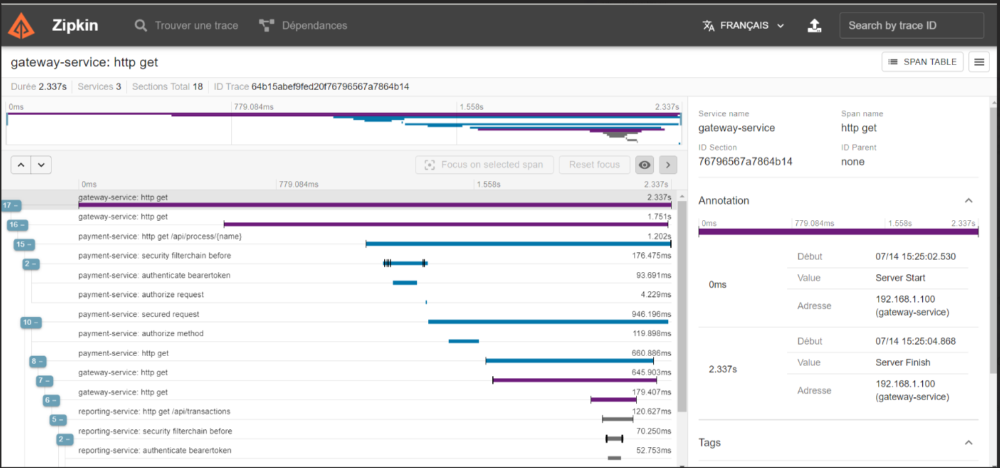

# TP microservice
## Description

La transformation d'une application monolithique en une architecture de microservices avec Spring Cloud est un processus complexe qui nécessite une planification et une attention particulières. Voici les étapes principales à suivre et les aspects à prendre en considération :   
<b>1. Analyse de l'application existante: </b>  
Le travaille consiste a identifiez les domaines les fonctionnalités qui peuvent être décomposés en services indépendants. dans notre cas on a extarit 3 microservice:  
    <b>a.</b>
    <b>b.</b>
    <b>c.</b>

### Conception de l'architecture cible:

Pour ce cas on a choisi de travaille avec l'infrastructre de spring cloud: Eureka, Config Server et Service Gateway, En résumé, Eureka facilite la découverte des services et leur interaction dynamique, le Config Server centralise la gestion des configurations des microservices, et le Service Gateway offre un point d'entrée centralisé pour l'accès aux services et des fonctionnalités supplémentaires de gestion de l'API. Ensemble, ces composants de Spring Cloud contribuent à simplifier et à faciliter le développement, le déploiement et la gestion d'une architecture de microservices
<b>Configuration centralisée:</b> Dans notre cas la config est centralisé dans le projet config-server, on peut la faire dans un dossier dans la machine ou bien dans une repo git, ou bien dans le classpath, voir [application.yml](config-server%2Fsrc%2Fmain%2Fresources%2Fapplication.yml). elle fortement consellier d'utiliser une repo git mais dans notre cas en mode devlopment on a utilise le class path
le config server inclus la configuration de tous les microservices fontionnels + la config du service gateway (parceque cette config peut évoluer de faire est a mesure)

### Sécurité
#### Sécuriser notre infrastructure :
Sécurisé le config server : Maintenant un utilisateur ne peut pas récupérer la configuration des micros-services à part sur des config serveur sauf si elle a le nom d'utilisateur et le mot de passe correct, et même Les micro-services ne peuvent récupérer leurs configurations à partir du config server sauf si elles ont le bon mot de passe et le nom en dessous des acteurs voir [application.yml](config-server%2Fsrc%2Fmain%2Fresources%2Fapplication.yml)
Eureka server : n'importe quel micro-service externe ne peut s'enregistrer dans notre service eureka sauf si elle a le mot de passe il est nom d’utilisateur correct voir [application.yml](eureka-service%2Fsrc%2Fmain%2Fresources%2Fapplication.yml) et un exemple de communication est dans [bootstrap.yml](gateway-service%2Fsrc%2Fmain%2Fresources%2Fbootstrap.yml)

#### Sécuriser nos microservices :
On a décidé d'utiliser le protocole de OAuth2 qui est basé sur la sécurité stateless avec un serveur d’autorisation IDP keycloak, Pour cela on a développé un starter de sécurité ou on a centralisé notre configuration, voire [keycloak-security-starter](keycloak-security-starter) ce starter est installable on peut l'utiliser comme depandance dans le projet quand veut sécurisé

Puisque tous les micro services sont maintenant sécurisés la communication entre eux est sécurisé donc pour consulter une ressource à partir d'un microservice j'ai besoin d'envoyer les informations de la connexion (token) dans la requête, pour voir si l’utilisateur a le droit de consulter la ressource externe demandé, pour cela on adevlopper un intercepteur de requetes qui récupere et inject le token dans touts les requetes voir [OAuth2FeignRequestInterceptor.java](keycloak-security-starter%2Fsrc%2Fmain%2Fjava%2Fcom%2Fexample%2Fsecurity%2Fstarter%2Fkeycloak%2Ffeign%2FOAuth2FeignRequestInterceptor.java)
### Surveillance
On travaille avec Spring boot 3 donc on a décidé de mettre en place un système de trace distribué en utilisant le projet micromètre et Zipkin l'outil open source de visualisation des traces, pour cela on a intégré la dépendance des projets micromètres dans tous les services gateway et tous les microservice pour maintenir la corrélation des logs et traces, Par conséquence on peut visualiser le cycle de vue d’une requête à travers tous les microservices en commençant par la gateway
voici un example 

### Résilience

### Déploiement et gestion des microservices

## Start infrastructure (Order is important)
<b>1. </b>`mvn spring-boot:run -f ./eureka-service/pom.xml`  
<b>2. </b>`mvn spring-boot:run -f ./config-server/pom.xml`  
<b>3. </b>`mvn spring-boot:run -f ./gateway-service/pom.xml`  
## Start projects (Order is not important)
<b>1. </b>`mvn spring-boot:run -f ./payment-service/pom.xml`  

## Start E2E tests
`E2E test can be performed via : `[e2e-test.http](e2e-test.http)