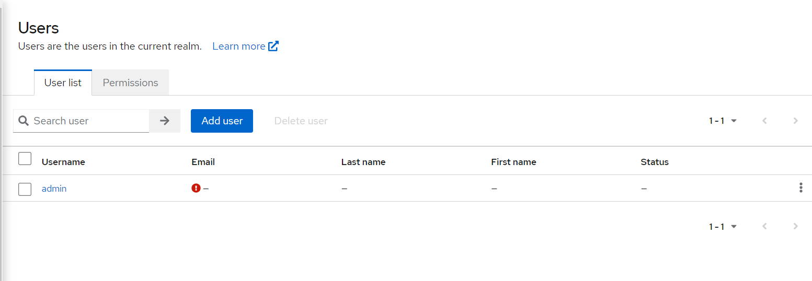

# TP microservice

## Description

La transformation d'une application monolithique en une architecture de microservices avec Spring Cloud est un processus
complexe qui nécessite une planification et une attention particulières. Voici les étapes principales à suivre et les
aspects à prendre en considération :  

### Analyse de l'application existante:

Le travaille consiste a identifiez les domaines les fonctionnalités qui peuvent être décomposés en services
indépendants. dans notre cas on a extarit 3 microservice: 

### Account service

##### Account Controller

<b> Create Account </b>
<ul>

<li><b>Endpoint:</b> POST /api/v1/accounts </li>
<li><b>Description:</b> Creates a new account </li>
<li><b>Request Body:</b> Account object </li>
<li><b>Response:</b> Created Account object </li>
<li><b>HTTP Status Codes:</b> </li>
<ul>
<li>201 (Created): Account created successfully.</li>
<li>400 (Bad Request): Invalid request body.</li>
</ul> 
</ul>

<b>Update Account</b>
 <ul>
        <li><b>Endpoint:</b> PUT /api/v1/accounts/{accountNo}</li>
        <li><b>Description:</b> Updates an existing account</li>
        <li><b>Path Parameter:</b> {accountNo} - Account number</li>
        <li><b>Request Body:</b> Updated Account object</li>
        <li><b>Response:</b> Updated Account object</li>
        <li><b>HTTP Status Codes:</b></li>
        <ul>
            <li>200 (OK): Account updated successfully.</li>
            <li>400 (Bad Request): Invalid request body.</li>
            <li>404 (Not Found): Account not found.</li>
        </ul>
    </ul>
<b>Get Account</b>
<ul>
        <li><b>Endpoint:</b> GET /api/v1/accounts/{accountNo}</li>
        <li><b>Description:</b> Retrieves an account by account number</li>
        <li><b>Path Parameter:</b> {accountNo} - Account number</li>
        <li><b>Response:</b> Account object</li>
        <li><b>HTTP Status Codes:</b></li>
        <ul>
            <li>200 (OK): Account found.</li>
            <li>404 (Not Found): Account not found.</li>
        </ul>
    </ul>

##### Balance Controller

<b>Update Balance</b>

<ul>
        <li><b>Endpoint:</b> PUT /api/v1/balances/{accountNo}</li>
        <li><b>Description:</b> Updates the balance of an account</li>
        <li><b>Path Parameter:</b> {accountNo} - Account number</li>
        <li><b>Request Body:</b> Updated Balance object</li>
        <li><b>Response:</b> Updated Balance object</li>
        <li><b>HTTP Status Codes:</b></li>
        <ul>
            <li>200 (OK): Balance updated successfully.</li>
            <li>400 (Bad Request): Invalid request body.</li>
            <li>404 (Not Found): Balance not found.</li>
        </ul>
    </ul>
<b>Get Balance</b>
    <ul>
        <li><b>Endpoint:</b> GET /api/v1/balances/{accountNo}</li>
        <li><b>Description:</b> Retrieves the balance of an account by account number</li>
        <li><b>Path Parameter:</b> {accountNo} - Account number</li>
        <li><b>Response:</b> Balance object</li>
        <li><b>HTTP Status Codes:</b></li>
        <ul>
            <li>200 (OK): Balance found.</li>
            <li>404 (Not Found): Balance not found.</li>
        </ul>
    </ul>

### Transaction service
#### RequestBkController

<b>Create Request</b>
<ul>
  <li><b>Endpoint:</b> POST /api/v1/requests</li>
  <li><b>Description:</b> Crée une nouvelle demande</li>
  <li><b>Request Body:</b> Objet RequestsBk</li>
  <li><b>Response:</b> Objet RequestsBk créé</li>
  <li><b>HTTP Status Codes:</b>
    <ul>
      <li>201 (Created): Demande créée avec succès.</li>
      <li>400 (Bad Request): Corps de requête invalide.</li>
    </ul>
  </li>
</ul>

<b>Confirm Request</b>
<ul>
  <li><b>Endpoint:</b> PUT /api/v1/requests/{requestId}/confirm</li>
  <li><b>Description:</b> Confirme une demande spécifiée par son identifiant</li>
  <li><b>Path Parameter:</b> {requestId} - Identifiant de la demande</li>
  <li><b>Response:</b> Objet TransactionBk confirmé</li>
  <li><b>HTTP Status Codes:</b>
    <ul>
      <li>200 (OK): Demande confirmée avec succès.</li>
      <li>400 (Bad Request): Corps de requête invalide.</li>
      <li>404 (Not Found): Demande non trouvée.</li>
    </ul>
  </li>
</ul>

#### TransactionController

<b>Get Transaction</b>
<ul>
  <li><b>Endpoint:</b> GET /api/v1/transactions/{transId}</li>
  <li><b>Description:</b> Récupère une transaction par son identifiant</li>
  <li><b>Path Parameter:</b> {transId} - Identifiant de la transaction</li>
  <li><b>Response:</b> Objet TransactionBk</li>
  <li><b>HTTP Status Codes:</b>
    <ul>
      <li>200 (OK): Transaction trouvée.</li>
      <li>404 (Not Found): Transaction non trouvée.</li>
    </ul>
  </li>
</ul>

<b>Get Statement</b>
<ul>
  <li><b>Endpoint:</b> GET /api/v1/transactions/statement</li>
  <li><b>Description:</b> Récupère un relevé de transactions pour un compte donné dans une période spécifiée</li>
  <li><b>Query Parameters:</b>
    <ul>
      <li><b>accountNo:</b> Numéro de compte</li>
      <li><b>startDate:</b> Date de début (au format YYYY-MM-DD)</li>
      <li><b>endDate:</b> Date de fin (au format YYYY-MM-DD)</li>
    </ul>
  </li>
  <li><b>Response:</b> Liste d'objets TransactionBk</li>
  <li><b>HTTP Status Codes:</b>
    <ul>
      <li>200 (OK): Relevé de transactions trouvé.</li>
      <li>404 (Not Found): Aucun relevé de transactions trouvé.</li>
    </ul>
  </li>
</ul>

### Conception de l'architecture cible:

Pour ce cas on a choisi de travaille avec l'infrastructre de spring cloud: Eureka, Config Server et Service Gateway, En
résumé, Eureka facilite la découverte des services et leur interaction dynamique, le Config Server centralise la gestion
des configurations des microservices, et le Service Gateway offre un point d'entrée centralisé pour l'accès aux services
et des fonctionnalités supplémentaires de gestion de l'API. Ensemble, ces composants de Spring Cloud contribuent à
simplifier et à faciliter le développement, le déploiement et la gestion d'une architecture de microservices

#### Configuration centralisée:

Dans notre cas la config est centralisé dans le projet config-server, on peut la faire dans un dossier dans la machine
ou bien dans une repo git, ou bien dans le classpath,
voir [application.yml](config-server%2Fsrc%2Fmain%2Fresources%2Fapplication.yml). elle fortement consellier d'utiliser
une repo git mais dans notre cas en mode devlopment on a utilise le class path
le config server inclus la configuration de tous les microservices fontionnels + la config du service gateway (parceque
cette config peut évoluer de faire est a mesure)

### Sécurité

#### Sécuriser notre infrastructure :

Sécurisé le config server : Maintenant un utilisateur ne peut pas récupérer la configuration des micros-services à part
sur des config serveur sauf si elle a le nom d'utilisateur et le mot de passe correct, et même Les micro-services ne
peuvent récupérer leurs configurations à partir du config server sauf si elles ont le bon mot de passe et le nom en
dessous des acteurs voir [application.yml](config-server%2Fsrc%2Fmain%2Fresources%2Fapplication.yml)
Eureka server : n'importe quel micro-service externe ne peut s'enregistrer dans notre service eureka sauf si elle a le
mot de passe il est nom d’utilisateur correct
voir [application.yml](eureka-service%2Fsrc%2Fmain%2Fresources%2Fapplication.yml) et un exemple de communication est
dans [bootstrap.yml](gateway-service%2Fsrc%2Fmain%2Fresources%2Fbootstrap.yml)

#### Sécuriser nos microservices :

On a décidé d'utiliser le protocole de OAuth2 qui est basé sur la sécurité stateless avec un serveur d’autorisation IDP
keycloak, Pour cela on a développé un starter de sécurité ou on a centralisé notre configuration,
voire [keycloak-security-starter](keycloak-security-starter) ce starter est installable on peut l'utiliser comme
depandance dans le projet quand veut sécurisé

Puisque tous les micro services sont maintenant sécurisés la communication entre eux est sécurisé donc pour consulter
une ressource à partir d'un microservice j'ai besoin d'envoyer les informations de la connexion (token) dans la requête,
pour voir si l’utilisateur a le droit de consulter la ressource externe demandé, pour cela on adevlopper un intercepteur
de requetes qui récupere et inject le token dans touts les requetes
voir [OAuth2FeignRequestInterceptor.java](keycloak-security-starter%2Fsrc%2Fmain%2Fjava%2Fcom%2Fexample%2Fsecurity%2Fstarter%2Fkeycloak%2Ffeign%2FOAuth2FeignRequestInterceptor.java)

### Surveillance

On travaille avec Spring boot 3 donc on a décidé de mettre en place un système de trace distribué en utilisant le projet
micromètre et Zipkin l'outil open source de visualisation des traces, pour cela on a intégré la dépendance des projets
micromètres dans tous les services gateway et tous les microservice pour maintenir la corrélation des logs et traces,
Par conséquence on peut visualiser le cycle de vue d’une requête à travers tous les microservices en commençant par la
gateway
voici un example 

### Résilience

#### CircuitBreaker:

Consiste a abondonner les requetes si la souce ne peut pas répondre dans ce cas on doit liberer la connexion, pour ne
pas connsomer plus de ressource dans la source demandé, et pour ne pas envoyer plus dd requetes a un système en pane,
pour implementer cette solution on a utiliser spring-cloud-starter-circuitbreaker-reactor-resilience4j les fitres sont
configure dans la configuration du gateway

#### FallBackProcessing:

Pour implementer le fallBackProcessing (Si par exemple un appel vers un microservice ne reussie pas on doit inmplementer
un autre solution pour ne pas blocker le traitement) pour cela on a utilisé spring-cloud-starter-netflix-hystrix, dans
tout nos clients feign on doit ajouter une fallBackMethode pour la gestion d'erreur voire un
exemple [ReportingClient.java](payment-service%2Fsrc%2Fmain%2Fjava%2Fcom%2Fexample%2Fpaymentservice%2Fcontroller%2Ffeign%2FReportingClient.java)

#### Retry:

Le pattern retry a été implementer au nive&au de la gateway comme un filtre pour les requetes GET sur tout les requetes,
on a implementer un solution consiste a faire tentative d'essai avec intervale de 50ms
voir [Gateway-Service.yml](config-server%2Fsrc%2Fmain%2Fresources%2Fconfig-files%2FGateway-Service.yml)

### Déploiement et gestion des microservices

## Start Project

### Start spring cloud infrastructure (Order is important)

<b>1. </b>`mvn spring-boot:run -f ./eureka-service/pom.xml`  
<b>2. </b>`mvn spring-boot:run -f ./config-server/pom.xml`  
<b>3. </b>`mvn spring-boot:run -f ./gateway-service/pom.xml`  

### Start tools

`docker-compose -f ./docker/docker-compose.yml -d`
`docker-compose -f ./docker/tracing/tracing-compose.yml -d`

#### SetUp Keycloak

vous pouvez vous connecter avec le username est mot de pass présenat du admin présent dans
le [docker-compose.yml](docker%2Fdocker-compose.yml) a l'adress 8081/auth et dans l'onglet master vous pouvez créer un
nouveau realm, vous pouvez importer directement le fichier [realm-export.json](docker%2Fkeycloak%2Frealm-export.json),
apres vous pouvez creer des user via l'interface graphique et les affecter des roles via l'onglet roles mapping

### Start projects (Order is not important)

<b>1. </b>`mvn spring-boot:run -f ./payment-service/pom.xml`  
<b>1. </b>`mvn spring-boot:run -f ./payment-service/pom.xml`  
<b>1. </b>`mvn spring-boot:run -f ./payment-service/pom.xml`  

### Start E2E tests

E2E test can be performed via postman by importing the following json
collection: [Bank E2E.postman_collection.json](Bank%20E2E.postman_collection.json)